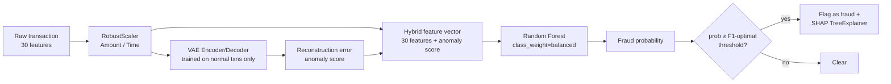
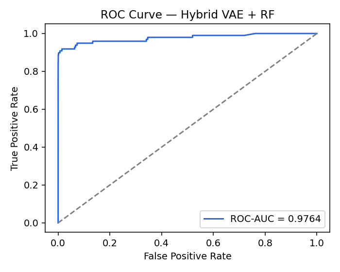
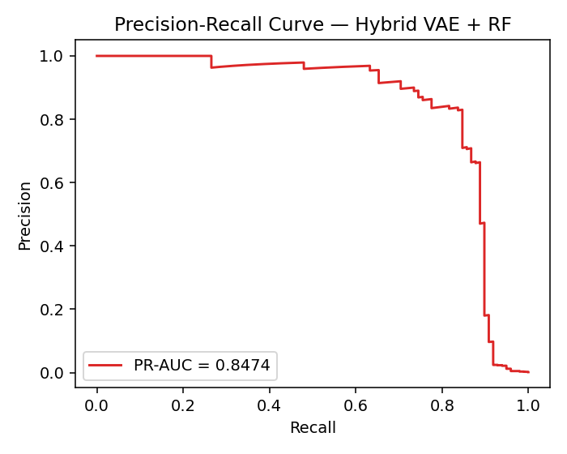
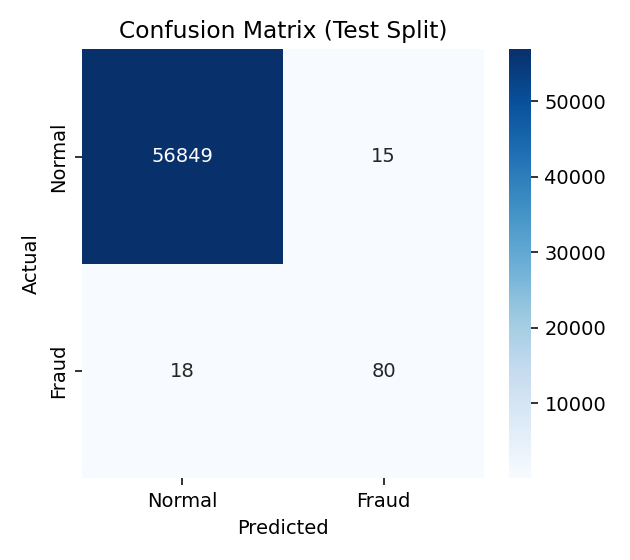
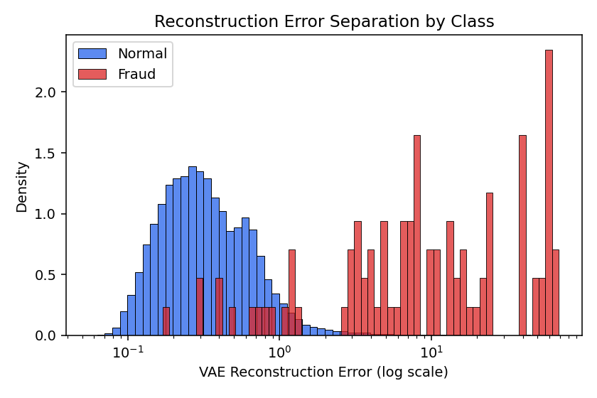
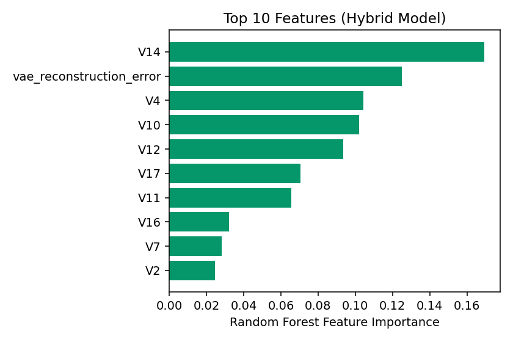

# ️ Fintech Fraud Shield — Hybrid VAE + Random Forest Fraud Detection

A production-shaped fraud detection system that combines **unsupervised representation learning**
(a Variational Autoencoder) with a **supervised classifier** (Random Forest) into a single hybrid
model, served behind a FastAPI microservice with a Streamlit analyst dashboard, containerized with
Docker Compose, explained per-transaction with SHAP, and covered by an automated test suite that
runs in CI without needing the real dataset.

Trained and evaluated on the [Kaggle "Credit Card Fraud Detection" dataset](https://www.kaggle.com/datasets/mlg-ulb/creditcardfraud)
(284,807 European card transactions, 492 confirmed frauds — 0.17%).


---

## Why a hybrid model?

A pure unsupervised anomaly detector (e.g. "flag anything with high VAE reconstruction error") has
no way to use the labelled fraud examples that *do* exist, and needs an arbitrary percentile cutoff
for its threshold. A pure supervised classifier, on the other hand, only ever learns from the ~500
known fraud cases and can miss fraud patterns that don't resemble anything in the training set.

This project uses both:
r

 
1. **VAE (unsupervised)** — trained only on legitimate transactions, so it never memorizes fraud
   patterns. It learns the manifold of "normal" spending behavior; its reconstruction error is a
   robust anomaly score that generalizes beyond the labelled fraud examples.
2. **Random Forest (supervised)** — trained on the 30 raw transaction features **plus the VAE
   reconstruction error as an engineered feature**, on labelled data. This lets the tree ensemble
   calibrate a precise, probabilistic decision boundary instead of an arbitrary percentile cutoff,
   while still benefiting from the anomaly signal the VAE learned from far more data than the fraud
   labels alone would allow.

This mirrors how autoencoder + gradient-boosted-tree hybrids are used in real fraud stacks.



---

## Results (held-out test split, never seen during training or threshold calibration)

| Metric | Value |
| --- | --- |
| ROC-AUC | **0.979** |
| PR-AUC | **0.847** |
| Fraud Precision | **83.5%** |
| Fraud Recall | **82.7%** |
| Fraud F1 | **83.1%** |
| True Negatives / False Positives | 56,848 / 16 |
| False Negatives / True Positives | 17 / 81 |

Evaluated on 56,962 held-out transactions (98 fraudulent). The decision threshold (`0.427`
probability) is not a magic number — it's the F1-optimal cutoff found on a separate validation
split via precision-recall search, then locked in and evaluated cold on the test split. Full numbers
are in [`assets/metrics.json`](assets/metrics.json), regenerated every time you run
`train_pipeline.py`.

<table>
<tr>
<td></td>
<td></td>
</tr>
<tr>
<td></td>
<td></td>
</tr>
</table>



The VAE's reconstruction error is consistently among the top features the Random Forest relies on —
evidence that the unsupervised signal is genuinely informative, not just along for the ride.

---

## Repository structure

```text
.
├── backend/
│   ├── main.py                 FastAPI inference service (hybrid scoring + SHAP)
│   ├── Dockerfile
│   └── requirements.txt
├── frontend/
│   ├── app.py                  Streamlit dashboard (simulator, bulk audit, model performance)
│   ├── Dockerfile
│   └── requirements.txt
├── tests/
│   ├── test_api.py             FastAPI backend tests (TestClient, real model artifacts)
│   └── test_frontend.py        Streamlit AppTest smoke tests
├── scripts/
│   └── generate_synthetic_dataset.py   Synthetic data generator used only by CI
├── assets/                     Evaluation plots + metrics.json (generated)
├── .github/workflows/ci.yml    Lint + synthetic-data pipeline smoke test + full test suite
├── train_pipeline.py           Trains VAE + Random Forest, calibrates threshold, writes assets/
├── evaluate_model.py           Black-box audit of a running backend against sample_test.csv
├── docker-compose.yml
├── requirements-dev.txt
├── .gitignore
└── LICENSE
```

`backend/*.pkl`, `backend/*.h5`, `assets/*.png`, and `sample_test.csv` are **generated artifacts**,
not checked into git (see `.gitignore`) — reproduce them with `train_pipeline.py`.

---

## Quickstart

### 1. Get the dataset

Download `creditcard.csv` from
[Kaggle: Credit Card Fraud Detection](https://www.kaggle.com/datasets/mlg-ulb/creditcardfraud)
and place it in the repository root. (It's ~150MB and licensed for non-commercial research use, so
it isn't bundled here.)

### 2. Set up a Python environment

```bash
python -m venv .venv
source .venv/bin/activate        # Windows: .venv\Scripts\Activate.ps1
pip install -r backend/requirements.txt
pip install -r frontend/requirements.txt
pip install -r requirements-dev.txt   # only needed for tests/plots
```

### 3. Train the hybrid model

```bash
python train_pipeline.py
```

This trains the VAE (~30–60s on CPU), engineers the hybrid feature set, trains the Random Forest,
calibrates the decision threshold on a held-out validation split, evaluates on a held-out test
split, and writes:

- `backend/vae_weights.weights.h5`, `backend/hybrid_rf.pkl`, `backend/scaler_amount.pkl`,
  `backend/scaler_time.pkl`, `backend/threshold.json`, `backend/feature_names.json`
- `sample_test.csv` — labelled validation set used by `evaluate_model.py` and the dashboard
- `assets/*.png`, `assets/metrics.json` — the plots and numbers in this README

### 4. Run the services

**Locally:**

```bash
uvicorn backend.main:app --host 0.0.0.0 --port 8000
# in a second terminal
BACKEND_URL=http://localhost:8000 streamlit run frontend/app.py
```

**With Docker Compose:**

```bash
docker-compose up --build
```

- Backend API: http://localhost:8000 (interactive docs at `/docs`)
- Frontend dashboard: http://localhost:8501

### 5. Validate

```bash
python evaluate_model.py                 # black-box audit against the running API
pytest tests/test_api.py -v               # backend integration tests
BACKEND_URL=http://localhost:8000 pytest tests/test_frontend.py -v   # frontend smoke tests
```

---

## The dashboard

Three workspaces:

- **Single Transaction Simulator** — load a real transaction (normal or known-fraud) from the
  validation set, tweak its dollar amount, and see the model's fraud probability, reconstruction
  error, and a SHAP bar chart of which features drove the decision.
- **Bulk Ledger Audit** — upload a CSV of transactions and get back fraud probabilities, a risk
  distribution histogram, the highest-risk rows, and (if a `Class` column is present) a live
  classification report.
- **Model Performance** — the ROC/PR curves, confusion matrix, and feature importance plots above,
  rendered from `assets/metrics.json` so they stay in sync with whatever model you last trained.

---

## API reference

### `POST /api/v1/audit`

```json
{
  "features": [[0.1, -0.5, 1.2, "... 27 more V-features ...", 25.0, 99.99]],
  "is_raw": false
}
```

- `features`: rows of 30-dimensional vectors — `V1..V28`, then `Amount`, then `Time`.
- `is_raw`: `true` if `Amount`/`Time` are in their original (unscaled) units; the backend will
  apply the fitted `RobustScaler`s before scoring. `false` if you're passing already-scaled
  `scaled_amount`/`scaled_time` (e.g. from `sample_test.csv`).

```json
{
  "threshold": 0.4271,
  "metrics": [
    {
      "reconstruction_error": 1.245102,
      "fraud_probability": 0.9964,
      "is_fraud": true,
      "shap_values": [0.01, 0.04, "... 29 more ..."]
    }
  ]
}
```

`shap_values` is only computed for the highest-risk transactions in a batch (top 10 by default,
configurable via `MAX_SHAP_PER_REQUEST`) to keep large bulk audits fast — SHAP is `null` for
everything else.

### `GET /health`

Returns `{"status": "ok", "model_loaded": true}` once startup has finished loading all model
assets. Used by the Docker healthchecks.

### `GET /api/v1/model-info`

Returns the architecture description, the active decision threshold, the ordered feature names,
and the Random Forest's tree count.

---

## Design notes & known limitations

- **Why RobustScaler for Amount/Time?** Both are heavily right-skewed with extreme outliers;
  RobustScaler (median/IQR) is far less distorted by them than standardization. The `V1`-`V28`
  columns are already PCA components from the original dataset and are left as-is.
- **Why clip `z_log_var` in the VAE?** Amount has outliers extreme enough that early in training,
  unclipped log-variance heads can blow up through the `exp()` in the reparameterization trick and
  silently produce `NaN` losses. Clipping to `[-10, 10]` fixes this without materially affecting
  the learned representation.
- **Threshold calibration is data-dependent.** The 0.427 threshold is specific to this dataset's
  fraud/normal cost tradeoff as captured by F1. In a real deployment you'd calibrate against the
  actual cost of a false positive (blocked legitimate purchase, support burden) vs. a false
  negative (fraud loss), which are rarely symmetric — and you'd re-calibrate periodically as fraud
  patterns drift.
- **This dataset is old and PCA-anonymized.** The `V1`-`V28` features can't be interpreted
  individually, and a static 2013 European card dataset won't reflect current fraud patterns. This
  project is a demonstration of the *architecture and engineering practices* (hybrid modelling,
  proper train/val/test separation, threshold calibration methodology, explainability, testing,
  containerization), not a claim that this exact model is deployment-ready for a real payments
  system.


## Possible extensions

- Swap the Random Forest for a gradient-boosted tree (XGBoost/LightGBM) and compare.
- Add a model registry / versioning story (e.g. MLflow) instead of flat files in `backend/`.
- Stream transactions through the API instead of batch-only scoring.
- Add drift detection on the reconstruction-error distribution to catch when the "normal" manifold
  the VAE learned stops matching current traffic.

---

## License

[MIT](LICENSE)
